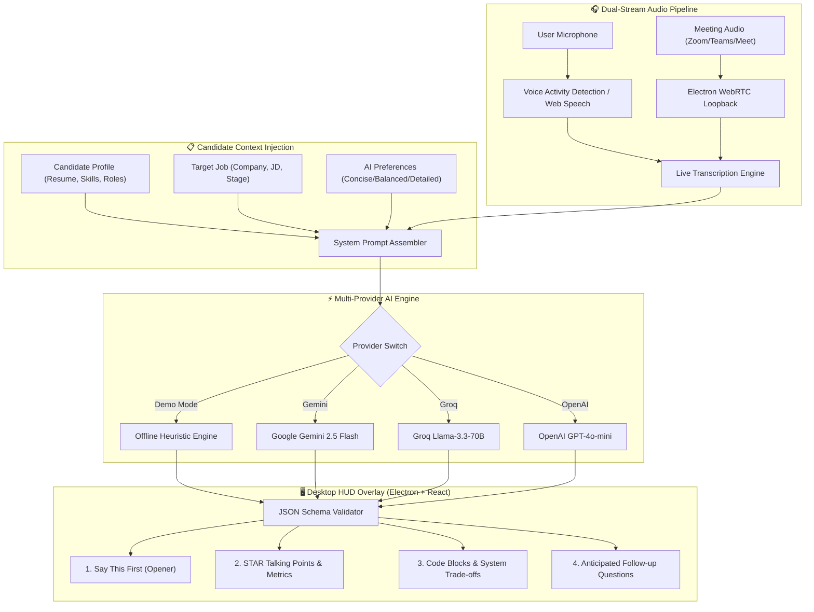

<div align="center">

#  Interview Helper AI
### *The Next-Generation Real-Time Heads-Up Display (HUD) for Live Technical & Behavioral Interviews*

[](https://nodejs.org/)
[](https://react.dev/)
[](https://www.typescriptlang.org/)
[](https://www.electronjs.org/)
[](https://vitejs.dev/)
[](https://tailwindcss.com/)
[](LICENSE)

<br/>

**Interview Helper AI** is a high-performance, discreet desktop assistant engineered to eliminate interview anxiety and freeze-ups. Sitting directly below your webcam as an always-on-top, semi-transparent HUD, Interview Helper AI captures conversation audio in real time, parses interviewer questions, and delivers structured talking points tailored specifically to **your actual resume, projects, and target role**.

[Key Features](#-key-features) • [Architecture](#-system-architecture) • [Getting Started](#-getting-started) • [Interview Modes](#-specialized-interview-modes) • [Hotkeys](#-global-stealth-hotkeys) • [Configuration](#-configuration--profiles) • [Privacy](#-privacy--security)

---

</div>

## 📑 Table of Contents

- [Overview](#-overview)
- [Key Features](#-key-features)
- [System Architecture](#-system-architecture)
- [Specialized Interview Modes](#-specialized-interview-modes)
- [Glanceable Answer Structure](#-glanceable-teleprompter-structure)
- [Global Stealth Hotkeys](#-global-stealth-hotkeys)
- [Getting Started](#-getting-started)
  - [Prerequisites](#prerequisites)
  - [Installation](#installation)
  - [Configuration](#configuration)
  - [Launch Commands](#launch-commands)
- [Audio Pipeline & Dual-Capture](#-audio-pipeline--dual-capture)
- [Mock Interview Simulator](#-built-in-mock-interview-simulator)
- [Project Directory Structure](#-project-directory-structure)
- [Privacy, Security & Ethics](#-privacy-security--ethics)
- [License](#-license)

---

## 💡 Overview

Live technical interviews demand instant recall under high stress. Candidates often struggle with momentary memory blocks or rambling responses. 

**Interview Helper AI** acts as a silent co-pilot:
- **Zero Awkward Pauses:** Provides an immediate 1-2 sentence opener (*"Say This First"*) so you can start talking immediately while glancing through key details.
- **Grounded in Your Experience:** Pulls quantifiable metrics, technologies, and achievements directly from your saved resume.
- **Stealth Overlay:** Transparent, frameless window with adjustable opacity (35%–100%) and eye-line font scaling (`S`, `M`, `L`) designed to sit unobtrusively beside video call windows (Zoom, Google Meet, Microsoft Teams).
- **Zero-Config Offline Demo Mode:** Works instantly out of the box with realistic response simulations without requiring paid API keys.

---

## ✨ Key Features

### 🖥️ Stealth Desktop HUD (Always-on-Top)
- **Frameless Glassmorphic Overlay:** Draggable, borderless design styled with Tailwind CSS v4.
- **Dynamic Opacity Slider:** Dial down to 35% opacity to blend into the background or crank up to 100% for high-contrast viewing.
- **Eye-Level Font Scaling:** Switch between Small, Medium, and Large typography to minimize eye travel away from the webcam.
- **Global Panic Key:** Instantly toggle HUD visibility (`Ctrl+Shift+H`) from anywhere in your operating system.

### 🎙️ Dual-Stream Audio Capture
- **System Audio Loopback:** Hooks into meeting audio (Zoom, Teams, Meet) using Electron desktop capturer and WebRTC loopback.
- **Microphone Channel:** Listens to your voice to keep track of the conversation flow.
- **Glowing Visualizer Waveform:** Real-time audio frequency visualizer indicating active listening state and sound levels.

### 🧠 Multi-Provider AI Inference
- **Offline Smart Simulation:** Pre-programmed high-yield responses for practicing without any API keys.
- **Google Gemini:** Integration with `gemini-2.5-flash` / `gemini-2.0-flash` for high-speed multi-turn reasoning.
- **Groq:** Ultra-low latency inference via Llama-3.3-70b-versatile (sub-500ms time-to-first-token).
- **OpenAI:** GPT-4o and GPT-4o-mini integration.

### 👤 Candidate Profiling & Custom Job Targeting
- Store your full resume, current role, years of experience, and primary tech stack.
- Input the target company name, job title, interview stage, and job description to get company-aligned answers.

---

## 🏗️ System Architecture



---

## 🎯 Specialized Interview Modes

Select modes on the fly via the top navigation bar to tune the AI output format:

| Mode | Target Scenarios | Response Strategy |
| :--- | :--- | :--- |
| **⭐ Behavioral** | Leadership, Culture Fit, Team Conflict, Project Ownership | Strictly structures answers using the **STAR Method** (Situation, Task, Action, Result) with measurable metrics. |
| **⚡ Technical** | Deep-dive concepts, language quirks, framework internals | Concise architectural explanations, best practices, memory management, and practical trade-offs. |
| **💻 Coding** | Data structures, LeetCode, algorithm walkthroughs | Optimal approach, Time/Space Big-O complexity, key boundary conditions, and clean idiomatic code snippets. |
| **🏛️ System Design** | Scalability, distributed systems, microservices | High-level data flow, caching tiers (Redis), database sharding (SQL/NoSQL), message brokers (Kafka), and resilience patterns. |
| **🌐 General** | "Tell me about yourself", salary expectations, motivation | Crisply connects your prior background directly to the company's stated mission and requirements. |

---

## 📜 Glanceable Teleprompter Structure

Every answer returned by Interview Helper AI follows a strict 4-tier schema designed for glanceability:

```json
{
  "quickHook": "Direct 1-2 sentence opener you can speak immediately out loud...",
  "bulletPoints": [
    "Situation & Task: At [Previous Company], addressed high p99 latency during peak traffic.",
    "Action: Re-architected hot data into a Redis cache layer and batched database queries.",
    "Result: Reduced p99 latency by 42% and supported 5x peak throughput without downtime."
  ],
  "codeSnippet": "// High-level architecture, query or algorithmic implementation",
  "followUps": [
    "How did you prevent cache stampede under sudden bursts?",
    "What metrics did you monitor to verify database health?"
  ]
}
```

---

## ⌨️ Global Stealth Hotkeys

Interview Helper AI registers native OS-level global keyboard shortcuts that function even when your video call or code editor is focused:

| Shortcut | Action | Description |
| :--- | :--- | :--- |
| <kbd>Ctrl</kbd> + <kbd>Shift</kbd> + <kbd>H</kbd> | **Stealth Toggle** | Instantly hides or restores the entire HUD overlay window. |
| <kbd>Ctrl</kbd> + <kbd>Shift</kbd> + <kbd>M</kbd> | **Toggle Mic** | Toggles live audio speech transcription on and off. |
| <kbd>Ctrl</kbd> + <kbd>Shift</kbd> + <kbd>Space</kbd> | **Force Answer** | Triggers instant AI response generation for the current transcript. |
| <kbd>Enter</kbd> | **Manual Submit** | Sends manual text input when typing questions directly into the input bar. |

---

## 🚀 Getting Started

### Prerequisites

- [Node.js](https://nodejs.org/) (v18.0.0 or higher recommended)
- [npm](https://www.npmjs.com/) (bundled with Node)

### Installation

1. Clone or download the repository:
   ```bash
   git clone https://github.com/pawanbudati/Interview-helper-ai.git
   cd Interview-helper-ai
   ```

2. Install dependencies:
   ```bash
   npm install
   ```

### Configuration

Copy the example environment file:
```bash
cp .env.example .env
```

Open `.env` and fill in whichever API key you wish to use (or leave blank to use the built-in **Offline Demo Mode**):

```ini
# Google Gemini API Key (Get a free key from https://aistudio.google.com/)
VITE_GEMINI_API_KEY=your_gemini_api_key_here

# Groq API Key (Optional, from https://console.groq.com/)
VITE_GROQ_API_KEY=your_groq_api_key_here

# OpenAI API Key (Optional, from https://platform.openai.com/)
VITE_OPENAI_API_KEY=your_openai_api_key_here
```

> [!TIP]
> You can also configure or swap API keys dynamically at runtime from inside the app by clicking the **Profile & Settings** gear icon.

### Launch Commands

#### Windows One-Click
Double-click `run.bat` in the root folder, or run:
```bash
npm run electron:dev
```

#### Browser HUD Mode
If you prefer running inside Google Chrome or Microsoft Edge instead of the native Electron window:
```bash
npm run dev
```
Navigate to `http://localhost:5173` in your browser.

---

## 🎙️ Audio Pipeline & Dual-Capture

Interview Helper AI features a two-tiered audio processing pipeline:

1. **Microphone (Web Speech / Speech Recognition API):**
   - Transcribes your spoken answers and responses in real-time.
   - Continuous speech recognition engine with automatic silence detection and reconnection logic.

2. **System Audio Loopback (WebRTC & Desktop Capturer):**
   - In Electron mode, Interview Helper AI accesses system audio streams using `navigator.mediaDevices.getUserMedia` with desktop capture constraints.
   - Enables capturing the interviewer's voice directly from Zoom, Microsoft Teams, or Google Meet desktop apps or browser windows.

---

## 🎓 Built-In Mock Interview Simulator

Sharpen your responses before your real interview with the built-in **Practice Room**:

1. Click the **Graduation Cap** icon in the header bar.
2. Select or generate questions customized to your profile and target company.
3. Record or type your answer.
4. Receive automated AI feedback:
   - **Score (0–100%)** based on clarity, specificity, and delivery.
   - **Identified Strengths:** What you articulated well.
   - **Areas of Improvement:** Missing metrics, vague statements, or STAR framework lapses.
   - **Model Answer:** A rewritten, top-tier response demonstrating optimal phrasing.

---

## 📁 Project Directory Structure

```
interview-helper-ai/
├── 📁 electron/
│   ├── main.cjs                   # Native frameless window, global shortcuts & capture IPC
│   └── preload.cjs                # Context-isolated IPC bridge
├── 📁 public/
│   ├── favicon.svg                # Application icon
│   └── icons.svg                  # SVG sprite assets
├── 📁 src/
│   ├── 📁 assets/                 # App imagery and graphic assets
│   ├── 📁 components/
│   │   ├── AnswerDisplay.tsx      # Teleprompter (Quick Hook, STAR bullets, Code, Follow-ups)
│   │   ├── AudioVisualizer.tsx    # Live glowing canvas audio frequency waveform
│   │   ├── CandidateProfileModal.tsx # Resume, target job & API credentials manager
│   │   ├── HUDHeader.tsx          # Draggable titlebar, mode selector, opacity & font controls
│   │   ├── LiveTranscript.tsx     # Real-time transcript feed & manual question input
│   │   ├── MockInterviewModal.tsx # Interactive practice interview room with AI grading
│   │   └── QuickPromptsBar.tsx    # One-click test scenarios for instant demonstration
│   ├── 📁 services/
│   │   ├── aiService.ts           # Gemini, Groq, OpenAI & offline simulation drivers
│   │   ├── speechService.ts       # Speech recognition, audio loopback & audio analyzer
│   │   └── storageService.ts      # LocalStorage persistence for candidate profiles & settings
│   ├── 📁 types/
│   │   └── index.ts               # Complete TypeScript interfaces and types
│   ├── App.css                    # Glassmorphism, animations and glow effects
│   ├── App.tsx                    # Primary HUD layout and state coordinator
│   ├── index.css                  # Tailwind CSS v4 directives
│   └── main.tsx                   # React root entrypoint
├── .env.example                   # Environment configuration template
├── .gitignore                     # Git ignore rules for build, env & temp files
├── index.html                     # HTML page template
├── package.json                   # Dependencies, scripts & project metadata
├── run.bat                        # Windows one-click start script
├── tsconfig.json                  # TypeScript compiler settings
└── vite.config.ts                 # Vite bundler configuration
```

---

## 🔒 Privacy, Security & Ethics

- **100% Client-Side / Local Storage:** All candidate profile data, resume text, target job info, and API keys are stored locally on your device (`localStorage`).
- **No Third-Party Telemetry:** Interview Helper AI does not transmit telemetry, analytics, or audio data to any central server.
- **Direct API Calls:** Network requests are made strictly and directly from your machine to the respective AI provider's official endpoints (Google AI Studio, Groq, or OpenAI).
- **Ethical Usage:** Interview Helper AI is designed as an educational and preparation tool to assist candidates in structuring thoughts, practicing with simulated feedback, and communicating their true background effectively.

---

## 📄 License

This project is licensed under the [MIT License](LICENSE) — feel free to customize and adapt it for your own interview preparation workflows.

<div align="center">
  <sub>Built with ❤️ for engineers, developers, and candidates worldwide.</sub>
</div>
